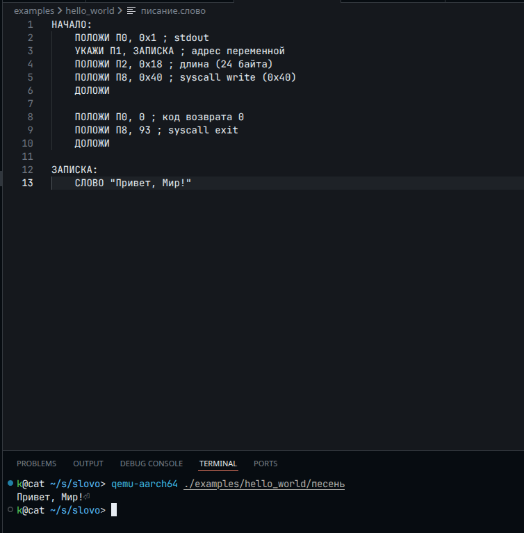

# 📜 С.Л.О.В.О (AArch64)

> *"Велик могучим русским языком написан код сей"*


-gold)

**C.Л.О.В.О.** — **С**истема **Л**огического **О**писания **В**ычислений **О**течественная.

Это первый в мире **древнерусский эзотерический компилятор** ассемблера для архитектуры **AArch64**.

Никаких чужеземных виртуальных машин. Только нативный машинный код, только ELF, полнота по Тьюрингу. Лепота.

---

## Суть
*   **Нативная компиляция**: Генерирует валидные объектные файлы `.o`, готовые к линковке.
*   **AArch64**: Работает на Apple Silicon, Raspberry Pi и других достойных процессорах.
*   **Импортозамещенный синтаксис**: никаких `MOV` и `RET`.
*   **Кириллическая арифметика**: Поддержка шестнадцатеричных чисел с буквами (`0х5Г`).

---

### Словарь Толмача

| Чужеземный ASM (ARM64) | С.Л.О.В.О | Описание |
| :--- | :--- | :--- |
| **Основы** | | |
| `MOV Xn, #imm` | `ПОЛОЖИ Пn, число` | Положить значение в помысел (регистр) |
| `ADR Xn, label` | `УКАЖИ Пn, метка` | Указать перстом на место в памяти |
| `SVC #0` | `ДОЛОЖИ` | Доложить Воеводе (системный вызов ядра) |
| `RET` | `ВЕРНИСЬ` | Возврат к делам прежним (выход из функции) |
| **Арифметика** | | |
| `ADD Rd, Rn, Rm`| `ПРИБАВЬ Пd, Пn, что` | Сложить помыслы |
| `SUB Rd, Rn, Rm`| `ВЫЧТИ Пd, Пn, что` | Убавить от помыслов |
| `MUL Rd, Rn, Rm` | `УМНОЖЬ Пd, Пn, Пm` | Приумножить (умножение) |
| `SDIV Rd, Rn, Rm` | `РАЗДЕЛИ Пd, Пn, Пm` | Разделить (знаковое деление) |
| `EOR Rd, Rn, Rm` | `РАЗНОСТЬ Пd, Пn, Пm` | Искать отличия (XOR / Исключающее ИЛИ) |
| **Сравнение и Прыжки** | | |
| `CMP Rn, Rm` | `СРАВНИ Пn, что` | Сличить значения |
| `B label` | `СТУПАЙ метка` | Идти в иное место без оглядки |
| `B.EQ label` | `КОЛИ_РАВНО СТУПАЙ` | Прыжок, ежели значения сошлись |
| `B.NE label` | `КОЛИ_НЕРАВНО СТУПАЙ` | Прыжок, ежели есть отличия |
| `B.GT` / `B.LT` | `КОЛИ_БОЛЬШЕ` / `МЕНЬШЕ` | Прыжки по результатам сличения |
| **Работа с Миром** | | |
| `LDR Rt, [Rn]` | `ИЗЫМИ Пt, Пn` | Достать из бересты (памяти) слово (8 байт) |
| `STR Rt, [Rn]` | `ВВЕРГНИ Пt, Пn` | Вписать в бересту слово (8 байт) |
| `LDRB Rt, [Rn]` | `ИЗЫМИ_БАЙТ Пt, Пn` | Достать лишь малую часть (1 байт) |
| `STRB Rt, [Rn]` | `ВВЕРГНИ_БАЙТ Пt, Пn` | Вписать малую часть (1 байт) |
| **Данные** | | |
| `.asciiz` | `СЛОВО "текст"` | Строковые данные (авто-выравнивание) |
| `.zero` | `ОТМЕРЬ число` | Оставить пустое место |
| `.incbin` | `ВЛОЖИ "файл"` | Вложить иной свиток (бинарный файл) |

### Важно: Кириллическая арифметика
Числа в С.Л.О.В.О записываются используя *исключительно кириллицу*!

Алфавит: `0 1 2 3 4 5 6 7 8 9 А Б В Г Д Е`

Пример:
```text
0х1АБ2ВГ3ДЕ
 ^ кириллическая х!
```

---

## Запуск

1. **Напишите Сказ (`.слово`)**
Пример файла `приветствие.слово`:
```asm
НАЧАЛО:
    ПОЛОЖИ П0, 0х1 ; stdout
    УКАЖИ П1, ЗАПИСКА ; адрес переменной
    ПОЛОЖИ П2, 0х18 ; длина (24 байта)
    ПОЛОЖИ П8, 0х40 ; syscall write (0х40)
    ДОЛОЖИ 

    ПОЛОЖИ П0, 0 ; код возврата 0
    ПОЛОЖИ П8, 93 ; syscall exit
    ДОЛОЖИ

ЗАПИСКА:
    СЛОВО "Привет, Мир!"
```

2. **Скомпилируйте**
```bash
cargo run --release -- приветствие.слово
```

3. **Слинкуйте и запустите**
```bash
ld -o сказ приветствие.o
./сказ
```

Пример работы:
<p align='left'>
    
</p>

## 🍎 Пример: Яблочко (Bad Apple)
В качестве доказательства полноты по Тьюрингу и оптимизации кода, на С.Л.О.В.О. был портирован графический бенчмарк "Bad Apple".

[📜 Исходный код сказа (examples/bad_apple/писание.слово)](examples/bad_apple/писание.слово)

**Демонстрация:**
[Bad Apple на языке СЛОВО (на ютубе)](https://youtu.be/rF_-a1Y_Dng)

---

## Право
Проект распространяется по лицензии MIT (Боярская вольная).
Копируйте и множьте код, но не забывайте указывать авторство.

---

### **⚠️ О наречении и сути**
> Проект «С.Л.О.В.О» является художественным произведением и эзотерическим языком программирования, созданным в исследовательских целях.
>
> Использование архаичной лексики — это дань уважения истории языка и славянскому фольклору. Все совпадения с реальными историческими документами или обрядами случайны. Термин "Яблочко" является отсылкой к одноименному народному танцу и графическому тесту.
